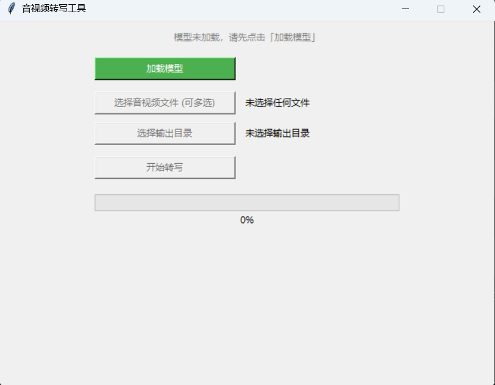

# Qwen3-ASR-GUI
This is a GUI programe for Qwen3-ASR

基于阿里开源的Qwen3-ASR-1.7B大模型开发的音视频文字提取工具，可以批量提取指定的音视频的文字。
# 使用说明
安装依赖
```shell
pip install -U qwen-asr modelscope python-dotenv
```
下载模型文件
```shell
modelscope download --model Qwen/Qwen3-ASR-1.7B --local_dir ./models/Qwen3-ASR-1.7B
```
启动项目
```shell
python app.py
```
启动后可以看到下面界面


启动之后点击“加载模型”，这里默认加载的是Qwen3-ASR-1.7B的模型，如果需要加载Qwen3-ASR-0.6B模型，需要修改代码。

这个软件支持任意桌面系统，无论是在Windows还是MacOS，或者Linux中均可运行。需要注意该软件不支持Linux服务器，只支持Linux桌面系统。

这是软件可以基于CPU来推理模型，也可以基于CUDA来推理模型，推荐使用CUDA，推理的速度更快，也就是显卡只支持英伟达显卡，不支持AMD和英特尔集成显卡。

使用CUDA推理，需要至少有6GB显存的显卡，如果有英伟达显卡，但是显存不够，可以修改代码使用CPU推理。

# 其它
[个人博客](https://blog.lukeewin.top)

[B站](https://space.bilibili.com/674558378)

[淘宝店铺](https://lukeewin.taobao.com/)
